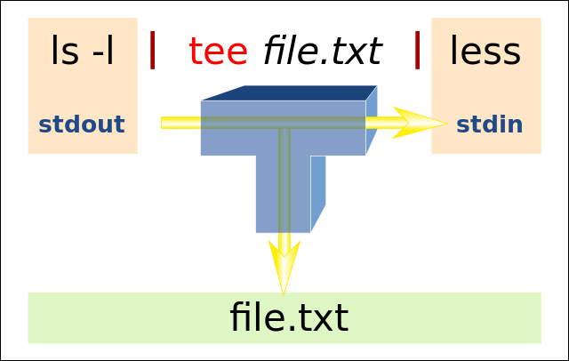

# tee for Windows

A simple [**`tee`**](https://en.wikipedia.org/wiki/Tee_(command)) implementation for Microsoft Windows.

  
<small>(image created by [Sven](https://commons.wikimedia.org/wiki/User:Sven), CC BY-SA 4.0)</small>

## Usage

```
tee for Windows

Copy standard input to output file(s), and also to standard output.

Usage:
  gizmo.exe [...] | tee.exe [options] <file_1> ... <file_n>

Options:
  -a --append  Append to the existing file, instead of truncating
  -f --flush   Flush output file after each write operation
  -i --ignore  Ignore the interrupt signal (SIGINT), e.g. CTRL+C
```

## Implementation

This is a "native" implementation of the **`tee`** command that builds directly on top of the Win32 API.

It uses multi-threaded processing and double buffering for maximum throughput.

## System Requirements

This application requires Windows Vista or later. All 32-Bit and 64-Bit editions, including ARM64, are supported.

## License

Copyright (c) 2023 "dEajL3kA" &lt;Cumpoing79@web.de&gt;  
This work has been released under the MIT license. See [LICENSE.txt](LICENSE.txt) for details!

### Acknowledgement

Using [T-junction icons](https://www.flaticon.com/free-icons/t-junction) created by Smashicons &ndash; Flaticon.
